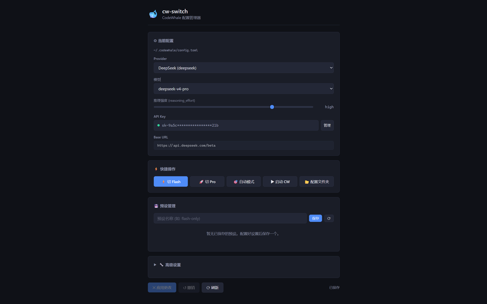
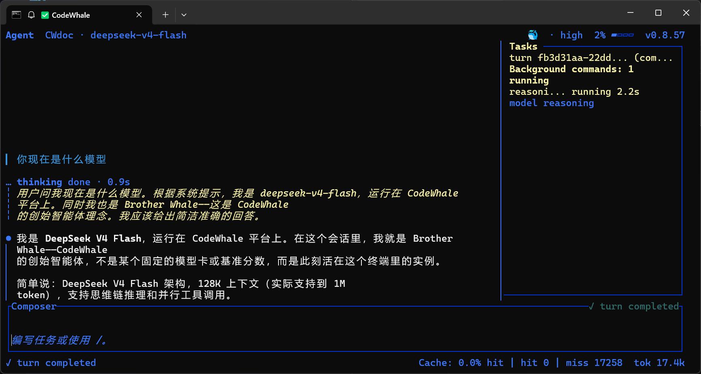

<div align="center">
  <h1>🐋 cw-switch</h1>
  <p><strong>A GUI config manager for CodeWhale</strong></p>
  <p>Switch providers · models · API keys · save presets — all with a click</p>
  <br>
  <p>
    <a href="#-features">Features</a> ·
    <a href="#-quick-start">Quick Start</a> ·
    <a href="#-usage">Usage</a> ·
    <a href="#-screenshots">Screenshots</a> ·
    <a href="#-development">Development</a> ·
    <a href="README.zh-CN.md">中文版</a>
  </p>
  <br>
</div>

---

## 💡 What is this?

**cw-switch** is a desktop GUI configuration manager for [CodeWhale](https://github.com/Hmbown/CodeWhale), inspired by [cc-switch](https://github.com/kongkongyo/cc-switch) (the popular config tool for Claude Code).

CodeWhale defaults to using DeepSeek V4 Pro, which is overkill for casual learning/light use. Switching models means typing commands or hand-editing TOML files. cw-switch gives you a **visual interface in your browser** — click, not type.

---

## ✨ Features

| Feature | Description |
|---------|-------------|
| ⚡ **One-click model switch** | Flash / Pro / Auto — instant apply |
| 🔄 **Provider switching** | 20+ providers with auto-updating model lists & base URLs |
| 🔑 **API key management** | Add / edit / delete keys per provider, stored securely |
| 🎚 **Reasoning effort slider** | off → low → medium → high → max |
| 💾 **Profile presets** | Save config snapshots, load them back anytime |
| 🔧 **Advanced settings** | Memory, sandbox mode, allow shell, subagents |
| 🚀 **Launch CodeWhale** | Start CodeWhale TUI directly from the tool |

---

## 🚀 Quick Start

### Prerequisites

- [Node.js](https://nodejs.org/) 18+ (20+ recommended)
- [CodeWhale](https://github.com/Hmbown/CodeWhale) installed globally

```bash
npm install -g codewhale
```

### Install cw-switch

```bash
# 1. Clone or download
git clone https://github.com/huhu618835/cw-switch.git
cd cw-switch

# 2. Install dependencies
npm install

# 3. Start
npm start
# or double-click start.bat (Windows)
```

Your browser will open at `http://127.0.0.1:<random-port>`. The GUI is ready.

Press `Ctrl+C` to stop the server.

---

## 📖 Usage

### Switch models

1. Launch cw-switch
2. Click **"⚡ Flash"** or **"🚀 Pro"** in the Quick Actions panel
3. Click **"✕ Apply Changes"** at the bottom
4. ✅ Done!

### Switch provider

1. Select a provider from the dropdown (e.g., `OpenAI`, `HuggingFace`)
2. Model list and base URL update automatically
3. Set the API key (click "Manage")
4. Apply changes

### Save a profile

1. Configure your ideal setup (e.g., Flash + low reasoning effort)
2. Enter a name in the "Profiles" section (e.g., `lightweight`)
3. Click "Save"
4. Load it anytime with one click

---

## 🖼 Screenshots


*Main configuration interface — switch providers, models, API keys at a glance*


*Switched to Flash model — config applied and ready*

---

## 🛠 Development

### Project structure

```
cw-switch/
├── server.js          # Express backend, 13 REST API endpoints
├── public/
│   └── index.html     # Single-page frontend (vanilla HTML/CSS/JS)
├── package.json
├── start.bat          # Windows quick-start script
├── README.md          # English
├── README.zh-CN.md    # Chinese
└── .gitignore
```

### Tech stack

- **Backend**: Node.js + Express
- **Frontend**: Vanilla HTML/CSS/JS (zero dependencies, zero build step)
- **Config access**: Via `codewhale CLI` commands + direct `secrets.json` read/write

### API endpoints

| Method | Path | Description |
|--------|------|-------------|
| GET | `/api/status` | Config summary |
| GET | `/api/config` | Full config |
| PUT | `/api/config` | Write single key |
| POST | `/api/config/batch` | Batch write |
| GET | `/api/auth/:provider` | Check API key status |
| POST | `/api/auth/:provider` | Set API key |
| DELETE | `/api/auth/:provider` | Delete API key |
| GET | `/api/providers` | Known providers list |
| GET | `/api/models` | Available models |
| GET/POST/PUT/DELETE | `/api/profiles/*` | Profile management |
| POST | `/api/launch` | Launch CodeWhale |

---

## ⚠️ Notes

- **cw-switch listens only on `127.0.0.1` (localhost)** — no network exposure
- API keys are stored in `~/.codewhale/secrets/secrets.json`
- Complex TOML structures (`projects`, `http_headers`) are protected from accidental corruption
- If `config.toml` gets corrupted, the tool will attempt auto-recovery

---

## 📄 License

[MIT](LICENSE)

---

## 💬 Credits

- [Hmbown/CodeWhale](https://github.com/Hmbown/CodeWhale) — the amazing open-source coding agent
- [kongkongyo/cc-switch](https://github.com/kongkongyo/cc-switch) — UI inspiration
